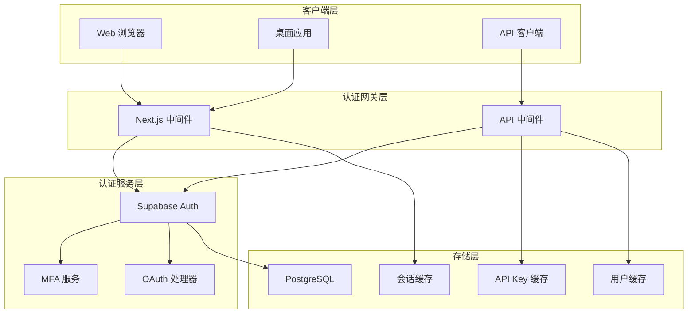
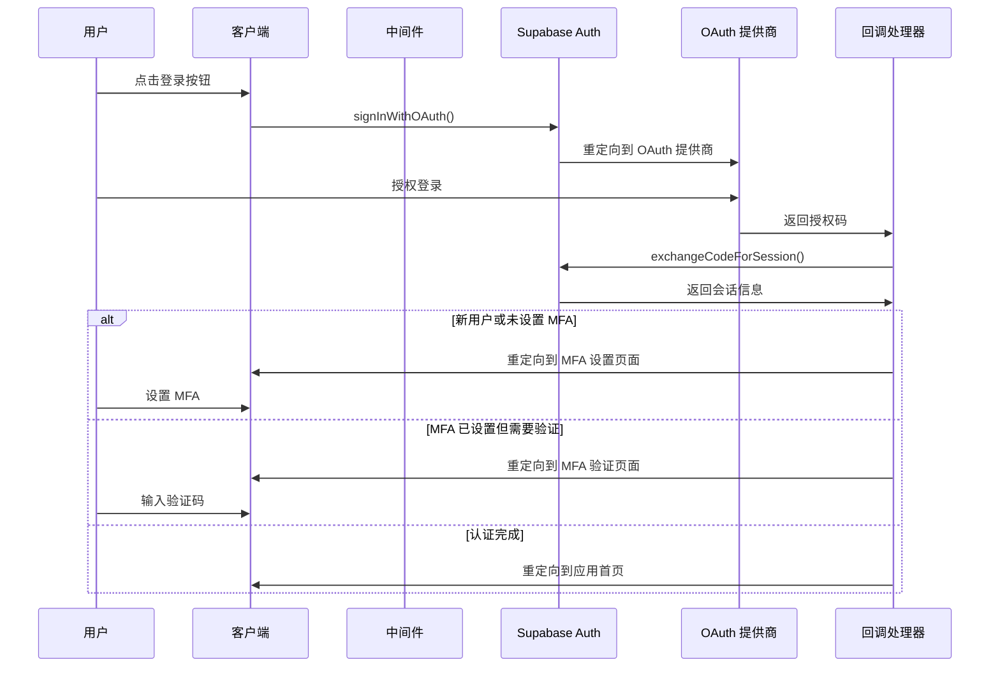
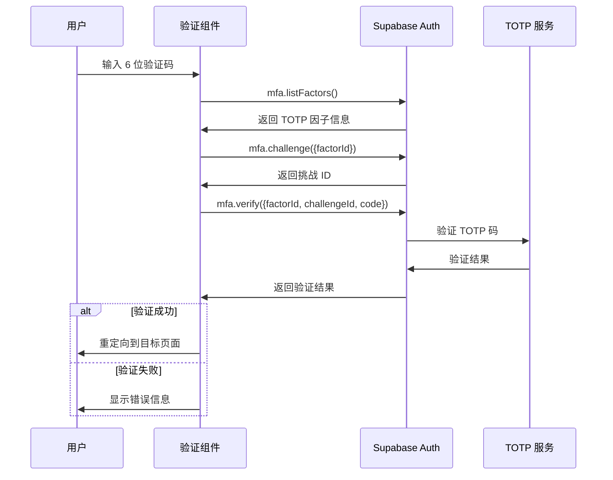
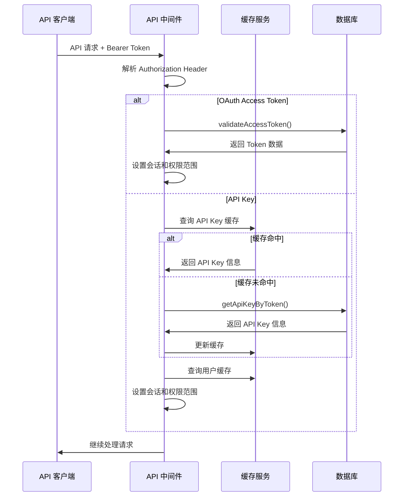

# Midday 认证系统技术文档

## 目录
- [系统概述](#系统概述)
- [技术架构](#技术架构)
- [认证流程](#认证流程)
- [核心组件](#核心组件)
- [安全机制](#安全机制)
- [实现细节](#实现细节)
- [配置指南](#配置指南)
- [最佳实践](#最佳实践)

## 系统概述

Midday 采用基于 Supabase Auth 的现代认证系统，提供多层次安全保障和灵活的认证策略。系统支持多种登录方式、强制多因素认证(MFA)，并针对不同客户端类型提供相应的认证机制。

### 核心特性
- 🔐 多因素认证 (TOTP)
- 🌐 OAuth 社交登录 (Google, GitHub, Apple)
- 🖥️ 多端支持 (Web, Desktop, API)
- 🔑 API Key 和 Access Token 双重认证
- 👥 团队级权限隔离
- ⚡ 高性能缓存机制

## 技术架构

### 整体架构图



### 目录结构

```
midday/
├── apps/
│   ├── dashboard/                    # 前端应用
│   │   ├── src/
│   │   │   ├── middleware.ts         # 路由中间件
│   │   │   ├── components/           # 认证相关组件
│   │   │   │   ├── google-sign-in.tsx
│   │   │   │   ├── github-sign-in.tsx
│   │   │   │   ├── apple-sign-in.tsx
│   │   │   │   ├── verify-mfa.tsx
│   │   │   │   ├── enroll-mfa.tsx
│   │   │   │   └── sign-out.tsx
│   │   │   ├── app/api/auth/
│   │   │   │   └── callback/route.ts # OAuth 回调处理
│   │   │   └── actions/              # 认证相关操作
│   │   │       ├── verify-otp-action.ts
│   │   │       ├── mfa-verify-action.ts
│   │   │       └── unenroll-mfa-action.ts
│   │   └── ...
│   └── api/                          # API 服务
│       ├── src/
│       │   ├── rest/
│       │   │   ├── middleware/
│       │   │   │   ├── auth.ts       # API 认证中间件
│       │   │   │   └── scope.ts      # 权限范围检查
│       │   │   └── routers/
│       │   │       ├── index.ts      # 路由配置
│       │   │       └── oauth.ts      # OAuth API
│       │   └── ...
│       └── ...
└── packages/
    ├── supabase/                     # Supabase 集成
    │   ├── src/
    │   │   ├── client/
    │   │   │   ├── server.ts         # 服务端客户端
    │   │   │   └── middleware.ts     # 会话更新中间件
    │   │   └── queries/
    │   │       └── cached-queries.ts # 缓存查询
    │   └── ...
    ├── db/                           # 数据库操作
    │   ├── src/
    │   │   └── queries/
    │   │       ├── oauth-applications.ts
    │   │       └── oauth-flow.ts
    │   └── ...
    └── ...
```

## 认证流程

### OAuth 登录流程



### MFA 验证流程



### API 认证流程



## 核心组件

### 1. Supabase 客户端配置

**文件**: `packages/supabase/src/client/server.ts`

```typescript
export async function createClient(options?: CreateClientOptions) {
  const { admin = false, ...rest } = options ?? {};
  const cookieStore = await cookies();

  const key = admin
    ? process.env.SUPABASE_SERVICE_KEY!
    : process.env.NEXT_PUBLIC_SUPABASE_ANON_KEY!;

  const auth = admin
    ? {
        persistSession: false,
        autoRefreshToken: false,
        detectSessionInUrl: false,
      }
    : {};

  return createServerClient<Database>(
    process.env.NEXT_PUBLIC_SUPABASE_URL!,
    key,
    {
      ...rest,
      cookies: {
        getAll() {
          return cookieStore.getAll();
        },
        setAll(cookiesToSet) {
          try {
            for (const { name, value, options } of cookiesToSet) {
              cookieStore.set(name, value, options);
            }
          } catch {
            // Server Component 中调用时忽略错误
          }
        },
      },
      auth,
    },
  );
}
```

**特性**:
- 支持管理员和普通用户两种模式
- 自动处理 Cookie 管理
- SSR 友好的配置

### 2. 路由保护中间件

**文件**: `apps/dashboard/src/middleware.ts`

```typescript
export async function middleware(request: NextRequest) {
  const response = await updateSession(request, I18nMiddleware(request));
  const supabase = await createClient();
  const url = new URL("/", request.url);
  const nextUrl = request.nextUrl;

  const {
    data: { session },
  } = await supabase.auth.getSession();

  // 1. 未认证用户检查
  if (!session && !isPublicRoute(newUrl.pathname)) {
    return NextResponse.redirect(loginUrl);
  }

  // 2. MFA 验证检查
  if (session) {
    const { data: mfaData } = await supabase.auth.mfa.getAuthenticatorAssuranceLevel();
    
    if (requiresMfaVerification(mfaData) && !isMfaRoute(newUrl.pathname)) {
      return NextResponse.redirect(mfaVerificationUrl);
    }
  }

  return response;
}
```

**保护机制**:
- 未登录用户自动重定向到登录页
- 强制 MFA 验证
- 支持返回 URL 参数
- 团队邀请链接特殊处理

### 3. API 认证中间件

**文件**: `apps/api/src/rest/middleware/auth.ts`

```typescript
export const withAuth: MiddlewareHandler = async (c, next) => {
  const authHeader = c.req.header("Authorization");
  const [scheme, token] = authHeader.split(" ");

  if (scheme !== "Bearer" || !token) {
    throw new HTTPException(401, { message: "Invalid authorization" });
  }

  // OAuth Access Token 处理
  if (token.startsWith("mid_access_token_")) {
    const tokenData = await validateAccessToken(db, token);
    if (!tokenData) {
      throw new HTTPException(401, { message: "Invalid access token" });
    }
    
    c.set("session", createSessionFromToken(tokenData));
    c.set("scopes", expandScopes(tokenData.scopes));
    return next();
  }

  // API Key 处理
  if (!isValidApiKeyFormat(token)) {
    throw new HTTPException(401, { message: "Invalid token format" });
  }

  const keyHash = hash(token);
  let apiKey = await apiKeyCache.get(keyHash);
  
  if (!apiKey) {
    apiKey = await getApiKeyByToken(db, keyHash);
    if (apiKey) {
      await apiKeyCache.set(keyHash, apiKey);
    }
  }

  if (!apiKey) {
    throw new HTTPException(401, { message: "Invalid API key" });
  }

  c.set("session", createSessionFromApiKey(apiKey));
  c.set("scopes", expandScopes(apiKey.scopes));
  
  await next();
};
```

**特性**:
- 支持双重认证机制
- 多层缓存优化
- 细粒度权限控制
- 自动更新使用时间

### 4. OAuth 登录组件

**文件**: `apps/dashboard/src/components/google-sign-in.tsx`

```typescript
export function GoogleSignIn() {
  const [isLoading, setLoading] = useState(false);
  const supabase = createClient();
  const searchParams = useSearchParams();
  const returnTo = searchParams.get("return_to");

  const handleSignIn = async () => {
    setLoading(true);

    const redirectTo = new URL("/api/auth/callback", getUrl());
    
    if (returnTo) {
      redirectTo.searchParams.append("return_to", returnTo);
    }
    
    redirectTo.searchParams.append("provider", "google");

    if (isDesktopApp()) {
      redirectTo.searchParams.append("client", "desktop");
      
      await supabase.auth.signInWithOAuth({
        provider: "google",
        options: {
          redirectTo: redirectTo.toString(),
          queryParams: {
            prompt: "select_account",
            client: "desktop",
          },
        },
      });
    } else {
      await supabase.auth.signInWithOAuth({
        provider: "google",
        options: {
          redirectTo: redirectTo.toString(),
          queryParams: {
            prompt: "select_account",
          },
        },
      });
    }
  };

  return (
    <SubmitButton onClick={handleSignIn} isSubmitting={isLoading}>
      <Icons.Google />
      <span>Continue with Google</span>
    </SubmitButton>
  );
}
```

**特性**:
- 多端适配 (Web/Desktop)
- 返回 URL 保持
- 加载状态管理
- 统一样式设计

### 5. MFA 验证组件

**文件**: `apps/dashboard/src/components/verify-mfa.tsx`

```typescript
export function VerifyMfa() {
  const [isValidating, setValidating] = useState(false);
  const [error, setError] = useState(false);
  const supabase = createClient();
  const router = useRouter();

  const onComplete = async (code: string) => {
    setValidating(true);

    // 获取 TOTP 因子
    const factors = await supabase.auth.mfa.listFactors();
    const totpFactor = factors.data.totp[0];

    if (!totpFactor) {
      setError(true);
      return;
    }

    // 创建挑战
    const challenge = await supabase.auth.mfa.challenge({ 
      factorId: totpFactor.id 
    });

    if (challenge.error) {
      setError(true);
      return;
    }

    // 验证码验证
    const verify = await supabase.auth.mfa.verify({
      factorId: totpFactor.id,
      challengeId: challenge.data.id,
      code,
    });

    if (verify.error) {
      setError(true);
      return;
    }

    // 验证成功，重定向
    router.push(getReturnUrl());
  };

  return (
    <InputOTP
      onComplete={onComplete}
      maxLength={6}
      autoFocus
      className={error ? "invalid" : undefined}
    />
  );
}
```

**特性**:
- 6 位数字验证码
- 实时验证状态
- 错误处理机制
- 自动对焦输入

## 安全机制

### 1. 多因素认证 (MFA)

- **强制启用**: 新用户首次登录后必须设置 MFA
- **TOTP 支持**: 兼容 Google Authenticator、Authy 等应用
- **AAL2 级别**: 支持认证保证级别 2
- **自动验证**: 中间件自动检查 MFA 状态

### 2. Token 安全

```typescript
// API Key 哈希存储
const keyHash = hash(token);

// OAuth Token 格式验证
if (!token.startsWith("mid_access_token_")) {
  throw new HTTPException(401, { message: "Invalid token format" });
}

// Bearer Token 验证
const [scheme, token] = authHeader.split(" ");
if (scheme !== "Bearer") {
  throw new HTTPException(401, { message: "Invalid authorization scheme" });
}
```

### 3. 权限范围控制

```typescript
// 权限范围扩展
export function expandScopes(scopes: string[]): Record<string, boolean> {
  const expandedScopes: Record<string, boolean> = {};
  
  for (const scope of scopes) {
    expandedScopes[scope] = true;
    
    // 继承权限逻辑
    if (scope === "transactions:write") {
      expandedScopes["transactions:read"] = true;
    }
  }
  
  return expandedScopes;
}

// 中间件权限检查
export const requireScope = (requiredScope: string) => {
  return async (c: Context, next: Next) => {
    const scopes = c.get("scopes");
    
    if (!scopes[requiredScope]) {
      throw new HTTPException(403, { 
        message: `Insufficient permissions. Required scope: ${requiredScope}` 
      });
    }
    
    await next();
  };
};
```

### 4. 缓存安全

- **多层缓存**: API Key、用户信息、会话数据分层缓存
- **缓存过期**: 设置合理的过期时间防止数据泄露
- **缓存失效**: 用户权限变更时自动清理缓存

## 实现细节

### 1. 会话管理

```typescript
// 请求级别缓存
export const getSession = cache(async () => {
  const supabase = await createClient();
  return supabase.auth.getSession();
});

// 中间件会话更新
export async function updateSession(request: NextRequest, response: NextResponse) {
  const supabase = createServerClient(
    process.env.NEXT_PUBLIC_SUPABASE_URL!,
    process.env.NEXT_PUBLIC_SUPABASE_ANON_KEY!,
    {
      cookies: {
        get(name: string) {
          return request.cookies.get(name)?.value;
        },
        set(name: string, value: string, options: CookieOptions) {
          request.cookies.set({ name, value, ...options });
          response.cookies.set({ name, value, ...options });
        },
        remove(name: string, options: CookieOptions) {
          request.cookies.set({ name, value: "", ...options });
          response.cookies.set({ name, value: "", ...options });
        },
      },
    },
  );

  return response;
}
```

### 2. 错误处理

```typescript
// 统一错误响应
export class AuthError extends HTTPException {
  constructor(status: number, message: string, cause?: string) {
    super(status, { 
      message,
      error: "authentication_error",
      cause 
    });
  }
}

// 错误处理中间件
export const errorHandler: ErrorHandler = (err, c) => {
  if (err instanceof AuthError) {
    return c.json({
      error: err.message,
      status: err.status
    }, err.status);
  }

  console.error('Unhandled error:', err);
  return c.json({
    error: 'Internal server error'
  }, 500);
};
```

### 3. 环境配置

```env
# Supabase 配置
NEXT_PUBLIC_SUPABASE_URL=https://your-project.supabase.co
NEXT_PUBLIC_SUPABASE_ANON_KEY=your-anon-key
SUPABASE_SERVICE_KEY=your-service-key

# OAuth 提供商配置
GOOGLE_CLIENT_ID=your-google-client-id
GOOGLE_CLIENT_SECRET=your-google-client-secret
GITHUB_CLIENT_ID=your-github-client-id
GITHUB_CLIENT_SECRET=your-github-client-secret

# 加密密钥
ENCRYPTION_KEY=your-32-character-encryption-key
```

## 配置指南

### 1. Supabase 设置

1. **创建项目**: 在 Supabase 控制台创建新项目
2. **启用认证**: 在 Authentication 设置中启用所需的提供商
3. **配置 OAuth**: 设置各个 OAuth 提供商的客户端 ID 和密钥
4. **MFA 设置**: 启用 TOTP 多因素认证
5. **RLS 策略**: 配置行级安全策略保护用户数据

### 2. OAuth 提供商配置

#### Google OAuth
```typescript
// Google Console 配置
{
  "client_id": "your-client-id",
  "redirect_uris": [
    "https://your-project.supabase.co/auth/v1/callback"
  ],
  "javascript_origins": [
    "http://localhost:3000",
    "https://your-domain.com"
  ]
}
```

#### GitHub OAuth
```typescript
// GitHub App 配置
{
  "name": "Your App Name",
  "homepage_url": "https://your-domain.com",
  "callback_url": "https://your-project.supabase.co/auth/v1/callback"
}
```

### 3. 数据库迁移

```sql
-- API Keys 表
CREATE TABLE api_keys (
  id UUID DEFAULT gen_random_uuid() PRIMARY KEY,
  name TEXT NOT NULL,
  key_hash TEXT UNIQUE NOT NULL,
  user_id UUID REFERENCES auth.users(id) ON DELETE CASCADE,
  team_id UUID NOT NULL,
  scopes TEXT[] DEFAULT '{}',
  last_used_at TIMESTAMP WITH TIME ZONE,
  created_at TIMESTAMP WITH TIME ZONE DEFAULT NOW(),
  expires_at TIMESTAMP WITH TIME ZONE
);

-- OAuth Applications 表
CREATE TABLE oauth_applications (
  id UUID DEFAULT gen_random_uuid() PRIMARY KEY,
  name TEXT NOT NULL,
  client_id TEXT UNIQUE NOT NULL,
  client_secret_encrypted TEXT NOT NULL,
  redirect_uris TEXT[] NOT NULL,
  scopes TEXT[] DEFAULT '{}',
  team_id UUID NOT NULL,
  created_at TIMESTAMP WITH TIME ZONE DEFAULT NOW()
);

-- Access Tokens 表
CREATE TABLE oauth_access_tokens (
  id UUID DEFAULT gen_random_uuid() PRIMARY KEY,
  token_hash TEXT UNIQUE NOT NULL,
  application_id UUID REFERENCES oauth_applications(id) ON DELETE CASCADE,
  user_id UUID REFERENCES auth.users(id) ON DELETE CASCADE,
  team_id UUID NOT NULL,
  scopes TEXT[] DEFAULT '{}',
  expires_at TIMESTAMP WITH TIME ZONE,
  created_at TIMESTAMP WITH TIME ZONE DEFAULT NOW()
);
```

## 最佳实践

### 1. 安全建议

- **定期轮换密钥**: 设置 API Key 和 Access Token 的过期时间
- **最小权限原则**: 只授予必要的权限范围
- **监控异常登录**: 记录和监控异常登录行为
- **HTTPS 强制**: 生产环境强制使用 HTTPS
- **Rate Limiting**: 对登录和 MFA 验证实施速率限制

### 2. 性能优化

- **缓存策略**: 合理使用多层缓存减少数据库查询
- **会话复用**: 利用 React cache 实现请求级别的会话缓存
- **连接池**: 配置合适的数据库连接池大小
- **CDN 配置**: 静态资源使用 CDN 加速

### 3. 监控和日志

```typescript
// 认证事件日志
export async function logAuthEvent(event: {
  type: 'login' | 'logout' | 'mfa_verify' | 'api_access',
  userId?: string,
  ip?: string,
  userAgent?: string,
  success: boolean,
  error?: string
}) {
  await analytics.track({
    event: `auth.${event.type}`,
    userId: event.userId,
    properties: {
      success: event.success,
      ip: event.ip,
      userAgent: event.userAgent,
      error: event.error
    }
  });
}
```

### 4. 错误处理最佳实践

- **用户友好错误**: 向用户显示清晰的错误信息
- **详细日志记录**: 在服务端记录详细的错误信息
- **优雅降级**: 在认证服务不可用时提供备用方案
- **重试机制**: 对临时性错误实施自动重试

---

## 总结

Midday 的认证系统采用了现代化的多层防护架构，通过 Supabase Auth 提供稳定可靠的认证服务，结合强制 MFA、细粒度权限控制和高性能缓存机制，确保了系统的安全性和可用性。

该系统的特点包括：
- **安全第一**: 强制 MFA、Token 加密、权限隔离
- **用户体验**: 多种登录方式、无缝跳转、状态保持
- **开发友好**: 类型安全、中间件保护、统一错误处理
- **性能优化**: 多层缓存、会话复用、连接池管理

通过本文档的详细说明，开发者可以深入理解 Midday 认证系统的设计理念和实现细节，并能够基于此架构构建自己的认证系统。