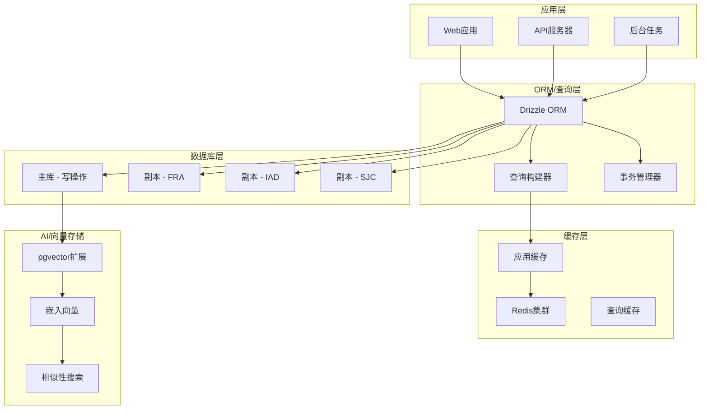
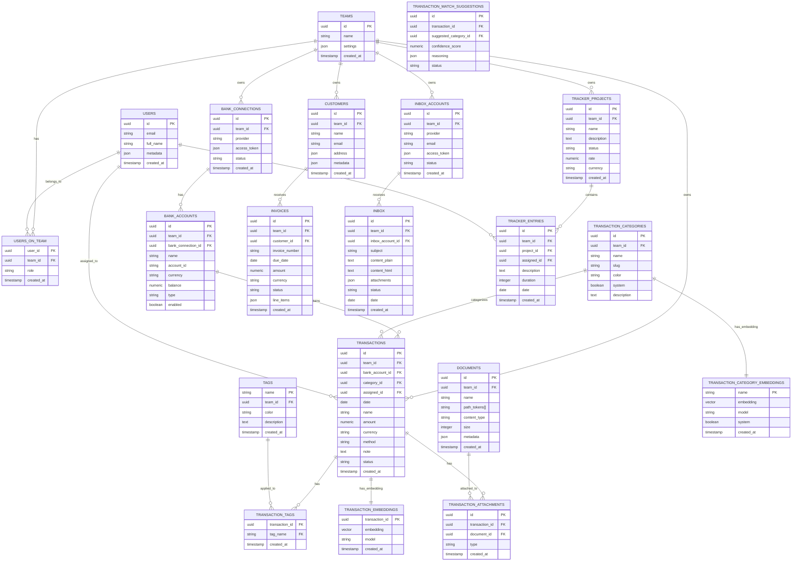
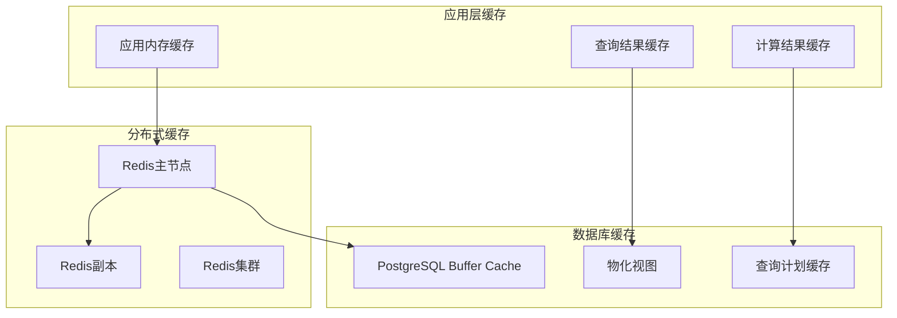

# Midday 数据库架构技术文档

## 目录
- [系统概述](#系统概述)
- [技术架构](#技术架构)
- [数据模型设计](#数据模型设计)
- [核心组件](#核心组件)
- [查询优化策略](#查询优化策略)
- [缓存架构](#缓存架构)
- [实现细节](#实现细节)
- [性能优化](#性能优化)
- [最佳实践](#最佳实践)

## 系统概述

Midday 采用基于 PostgreSQL 的现代数据库架构，使用 Drizzle ORM 提供类型安全的数据访问层。系统支持多区域读写分离、向量检索、实时数据同步，并针对财务数据处理进行了深度优化。

### 核心特性
- 🌐 多区域读写分离 (Primary-Replica Architecture)
- 🔍 向量数据库集成 (pgvector for AI/ML)
- 📊 实时物化视图 (Materialized Views)
- 🏗️ Type-Safe ORM (Drizzle)
- ⚡ 多层缓存机制 (Redis + Application Cache)
- 🔒 行级安全 (Row Level Security)
- 📈 智能查询优化
- 🌍 地理分布式部署

## 技术架构

### 整体架构图



### 目录结构

```
packages/db/
├── src/
│   ├── client.ts                     # 数据库连接管理
│   ├── replicas.ts                   # 读写分离实现
│   ├── schema.ts                     # 数据库模式定义
│   ├── job-client.ts                 # 后台任务数据库连接
│   ├── queries/                      # 查询层
│   │   ├── index.ts                  # 查询入口
│   │   ├── transactions.ts           # 交易相关查询
│   │   ├── bank-accounts.ts          # 银行账户查询
│   │   ├── users.ts                  # 用户管理查询
│   │   ├── teams.ts                  # 团队管理查询
│   │   ├── invoices.ts              # 发票管理查询
│   │   ├── customers.ts             # 客户管理查询
│   │   ├── documents.ts             # 文档管理查询
│   │   ├── inbox.ts                 # 收件箱查询
│   │   ├── activities.ts            # 活动日志查询
│   │   ├── reports.ts               # 报表统计查询
│   │   ├── search.ts                # 全文搜索查询
│   │   ├── tags.ts                  # 标签管理查询
│   │   ├── tracker-*.ts             # 时间追踪查询
│   │   ├── oauth-*.ts               # OAuth相关查询
│   │   ├── api-keys.ts              # API密钥管理
│   │   ├── *-embeddings.ts          # 向量嵌入查询
│   │   ├── *-matching.ts            # 智能匹配查询
│   │   └── notification-settings.ts # 通知设置查询
│   ├── utils/                        # 工具函数
│   │   ├── embeddings.ts             # 向量处理工具
│   │   ├── search-query.ts           # 搜索查询构建
│   │   ├── transaction-matching.ts   # 交易匹配算法
│   │   ├── api-keys.ts               # API密钥工具
│   │   ├── health.ts                 # 健康检查
│   │   └── log-activity.ts           # 活动日志工具
│   └── test/                         # 测试文件
│       ├── golden-dataset.ts         # 黄金数据集
│       ├── transaction-matching.*.ts # 匹配算法测试
│       └── validate-golden-dataset.ts
├── migrations/                       # 数据库迁移文件
└── drizzle.config.ts                # Drizzle配置
```

## 数据模型设计

### 核心实体关系图



### 枚举类型定义

```typescript
// 账户类型
export const accountTypeEnum = pgEnum("account_type", [
  "depository",      // 存款账户
  "credit",          // 信贷账户
  "other_asset",     // 其他资产
  "loan",            // 贷款
  "other_liability", // 其他负债
]);

// 银行服务提供商
export const bankProvidersEnum = pgEnum("bank_providers", [
  "gocardless",      // GoCardless (欧洲)
  "plaid",           // Plaid (美国)
  "teller",          // Teller
  "enablebanking",   // EnableBanking
]);

// 连接状态
export const connectionStatusEnum = pgEnum("connection_status", [
  "disconnected",    // 已断开
  "connected",       // 已连接
  "unknown",         // 未知状态
]);

// 交易方法
export const transactionMethodsEnum = pgEnum("transaction_methods", [
  "ach",            // ACH转账
  "wire",           // 电汇
  "check",          // 支票
  "card",           // 卡片支付
  "other",          // 其他
]);

// 交易状态
export const transactionStatusEnum = pgEnum("transaction_status", [
  "posted",         // 已过账
  "pending",        // 待处理
  "processed",      // 已处理
]);

// 收件箱状态
export const inboxStatusEnum = pgEnum("inbox_status", [
  "processing",     // 处理中
  "pending",        // 待处理
  "archived",       // 已归档
  "new",           // 新建
  "analyzing",      // 分析中
  "suggested_match", // 建议匹配
  "no_match",       // 无匹配
  "done",          // 已完成
]);

// 活动类型
export const activityTypeEnum = pgEnum("activity_type", [
  "transactions_imported",      // 交易导入
  "transactions_categorized",   // 交易分类
  "transactions_assigned",      // 交易分配
  "transaction_attachment_created", // 附件创建
  "transaction_category_created",   // 分类创建
  "transactions_exported",      // 交易导出
  "customer_created",          // 客户创建
]);
```

## 核心组件

### 1. 数据库连接管理

**文件**: `packages/db/src/client.ts`

```typescript
// 优化的连接池配置 - 针对Fly.io的3个VM实例
const connectionConfig = {
  prepare: false,           // 禁用预准备语句以减少内存使用
  max: 2,                  // 每个池最多2个连接（保守配置）
  idle_timeout: 90,        // 90秒空闲超时，减少断开
  max_lifetime: 0,         // 禁用强制回收
  connect_timeout: 10,     // 10秒连接超时
};

// 主库连接池
const primaryPool = postgres(
  process.env.DATABASE_PRIMARY_URL!,
  connectionConfig,
);

// 地理分布的副本连接池
const fraPool = postgres(process.env.DATABASE_FRA_URL!, connectionConfig); // 法兰克福
const sjcPool = postgres(process.env.DATABASE_SJC_URL!, connectionConfig); // 圣何塞
const iadPool = postgres(process.env.DATABASE_IAD_URL!, connectionConfig); // 华盛顿

// 根据Fly.io区域选择最优副本
const getReplicaIndexForRegion = () => {
  switch (process.env.FLY_REGION) {
    case "fra": return 0;  // 欧洲用户 -> 法兰克福
    case "iad": return 1;  // 美东用户 -> 华盛顿
    case "sjc": return 2;  // 美西用户 -> 圣何塞
    default: return 0;     // 默认法兰克福
  }
};

// 创建带副本的数据库连接
export const connectDb = async () => {
  const replicaIndex = getReplicaIndexForRegion();

  return withReplicas(
    primaryDb,
    [
      drizzle(fraPool, { schema, casing: "snake_case" }),
      drizzle(iadPool, { schema, casing: "snake_case" }),
      drizzle(sjcPool, { schema, casing: "snake_case" }),
    ],
    (replicas) => replicas[replicaIndex]!,
  );
};
```

**特性**:
- 地理感知的连接路由
- 保守的连接池配置
- 自动故障转移
- Snake case 字段映射

### 2. 读写分离实现

**文件**: `packages/db/src/replicas.ts`

```typescript
export const withReplicas = <Q extends PgDatabase<any, any, any>>(
  primary: Q,
  replicas: [Q, ...Q[]],
  getReplica: (replicas: Q[]) => Q = () =>
    replicas[Math.floor(Math.random() * replicas.length)]!,
): ReplicatedDatabase<Q> => {
  const createDatabase = (usePrimary = false): ReplicatedDatabase<Q> => {
    // 读操作路由逻辑
    const getDbForRead = () => (usePrimary ? primary : getReplica(replicas));

    // 读操作 - 自动路由到副本
    const select: Q["select"] = (...args: []) => getDbForRead().select(...args);
    const selectDistinct: Q["selectDistinct"] = (...args: []) =>
      getDbForRead().selectDistinct(...args);
    const $count: Q["$count"] = (...args: [any]) =>
      getDbForRead().$count(...args);

    // 写操作 - 强制路由到主库
    const update: Q["update"] = (...args: [any]) => primary.update(...args);
    const insert: Q["insert"] = (...args: [any]) => primary.insert(...args);
    const $delete: Q["delete"] = (...args: [any]) => primary.delete(...args);
    const transaction: Q["transaction"] = (...args: [any]) =>
      primary.transaction(...args);

    // 提供强制使用主库的选项
    const usePrimaryOnly = (): ReplicatedDatabase<Q> => createDatabase(true);

    return {
      ...primary,
      select,
      selectDistinct,
      $count,
      update,
      insert,
      delete: $delete,
      transaction,
      executeOnReplica: getDbForRead().execute,
      transactionOnReplica: getDbForRead().transaction,
      usePrimaryOnly,
      get query() {
        return getDbForRead().query;
      },
    };
  };

  return createDatabase(false);
};
```

**核心特性**:
- **智能路由**: 读操作自动路由到副本，写操作路由到主库
- **故障转移**: 副本不可用时自动使用主库
- **强制主库**: 提供 `usePrimaryOnly()` 方法处理一致性要求高的场景
- **透明代理**: 保持原有API接口不变

### 3. 向量数据库集成

**文件**: `packages/db/src/utils/embeddings.ts`

```typescript
/**
 * 生成并存储分类的嵌入向量
 * 该函数是幂等的 - 如果嵌入已存在则不会重新生成
 */
export async function generateCategoryEmbedding(
  db: Database,
  params: GenerateCategoryEmbeddingParams,
) {
  const { name, system = false, model } = params;

  try {
    // 首先检查嵌入是否已存在
    const existingEmbedding = await db
      .select({ name: transactionCategoryEmbeddings.name })
      .from(transactionCategoryEmbeddings)
      .where(eq(transactionCategoryEmbeddings.name, name))
      .limit(1);

    if (existingEmbedding.length > 0) {
      return; // 已存在，跳过生成
    }

    // 使用AI服务生成嵌入向量
    const embedding = await CategoryEmbeddings.generateEmbedding(name, model);

    // 存储到数据库
    await upsertCategoryEmbedding(db, {
      name,
      embedding: JSON.stringify(embedding), // pgvector格式
      system,
      model: model || "gemini-embedding-001",
    });

    logger.info(`Generated embedding for category: ${name}`);
  } catch (error) {
    logger.error(`Failed to generate embedding for category ${name}:`, error);
    throw error;
  }
}

/**
 * 基于向量相似性搜索相关分类
 */
export async function findSimilarCategories(
  db: Database,
  queryText: string,
  options: {
    limit?: number;
    threshold?: number;
    systemOnly?: boolean;
  } = {}
) {
  const { limit = 5, threshold = 0.7, systemOnly = false } = options;

  // 生成查询文本的嵌入向量
  const queryEmbedding = await CategoryEmbeddings.generateEmbedding(queryText);

  // 使用余弦相似度搜索
  const conditions = [
    sql`1 - (${transactionCategoryEmbeddings.embedding} <=> ${JSON.stringify(queryEmbedding)}) > ${threshold}`
  ];

  if (systemOnly) {
    conditions.push(eq(transactionCategoryEmbeddings.system, true));
  }

  const results = await db
    .select({
      name: transactionCategoryEmbeddings.name,
      similarity: sql<number>`1 - (${transactionCategoryEmbeddings.embedding} <=> ${JSON.stringify(queryEmbedding)})`,
    })
    .from(transactionCategoryEmbeddings)
    .where(and(...conditions))
    .orderBy(desc(sql`1 - (${transactionCategoryEmbeddings.embedding} <=> ${JSON.stringify(queryEmbedding)})`))
    .limit(limit);

  return results;
}
```

**向量索引优化**:
```sql
-- HNSW索引配置用于快速向量相似性搜索
CREATE INDEX transaction_category_embeddings_vector_idx 
ON transaction_category_embeddings 
USING hnsw (embedding vector_cosine_ops) 
WITH (m = 16, ef_construction = 64);
```

### 4. 智能查询构建器

**文件**: `packages/db/src/queries/transactions.ts`

```typescript
export type GetTransactionsParams = {
  teamId: string;
  cursor?: string | null;
  sort?: string[] | null;
  pageSize?: number;
  q?: string | null;           // 全文搜索
  statuses?: string[] | null;  // 状态过滤
  attachments?: "include" | "exclude" | null;
  categories?: string[] | null; // 分类过滤
  tags?: string[] | null;      // 标签过滤
  accounts?: string[] | null;  // 账户过滤
  assignees?: string[] | null; // 分配人过滤
  from?: string | null;        // 日期范围
  to?: string | null;
};

export async function getTransactions(
  db: Database,
  params: GetTransactionsParams
) {
  const {
    teamId,
    cursor,
    sort = [{ column: "date", direction: "desc" }],
    pageSize = 50,
    q,
    statuses,
    attachments,
    categories,
    tags,
    accounts,
    assignees,
    from,
    to,
  } = params;

  // 构建复杂查询条件
  const conditions: SQL[] = [eq(transactions.teamId, teamId)];

  // 全文搜索 - 使用PostgreSQL的tsvector
  if (q) {
    const searchQuery = buildSearchQuery(q);
    conditions.push(
      sql`to_tsvector('english', ${transactions.name}) @@ to_tsquery('english', ${searchQuery})`
    );
  }

  // 状态过滤
  if (statuses?.length) {
    conditions.push(inArray(transactions.status, statuses));
  }

  // 附件过滤
  if (attachments === "include") {
    conditions.push(
      sql`EXISTS (
        SELECT 1 FROM ${transactionAttachments} 
        WHERE ${transactionAttachments.transactionId} = ${transactions.id}
      )`
    );
  } else if (attachments === "exclude") {
    conditions.push(
      sql`NOT EXISTS (
        SELECT 1 FROM ${transactionAttachments} 
        WHERE ${transactionAttachments.transactionId} = ${transactions.id}
      )`
    );
  }

  // 分类过滤 - 支持多选
  if (categories?.length) {
    conditions.push(inArray(transactions.categoryId, categories));
  }

  // 标签过滤 - 使用EXISTS子查询
  if (tags?.length) {
    const tagConditions = tags.map(tag => 
      sql`EXISTS (
        SELECT 1 FROM ${transactionTags} 
        WHERE ${transactionTags.transactionId} = ${transactions.id} 
        AND ${transactionTags.tagName} = ${tag}
      )`
    );
    conditions.push(or(...tagConditions));
  }

  // 日期范围过滤
  if (from) {
    conditions.push(gte(transactions.date, from));
  }
  if (to) {
    conditions.push(lte(transactions.date, to));
  }

  // 游标分页支持
  if (cursor) {
    const [date, id] = cursor.split(":");
    conditions.push(
      or(
        lt(transactions.date, date),
        and(eq(transactions.date, date), lt(transactions.id, id))
      )
    );
  }

  // 动态排序构建
  const orderByClause = sort.map(({ column, direction }) => {
    const col = transactions[column as keyof typeof transactions];
    return direction === "asc" ? asc(col) : desc(col);
  });

  // 执行查询 - 自动路由到副本
  const result = await db
    .select({
      id: transactions.id,
      date: transactions.date,
      name: transactions.name,
      amount: transactions.amount,
      currency: transactions.currency,
      status: transactions.status,
      method: transactions.method,
      note: transactions.note,
      // 关联数据
      category: {
        id: transactionCategories.id,
        name: transactionCategories.name,
        color: transactionCategories.color,
      },
      bankAccount: {
        id: bankAccounts.id,
        name: bankAccounts.name,
        currency: bankAccounts.currency,
      },
      assignee: {
        id: users.id,
        fullName: users.fullName,
        email: users.email,
      },
      // 附件数量
      attachmentCount: sql<number>`(
        SELECT COUNT(*) FROM ${transactionAttachments} 
        WHERE ${transactionAttachments.transactionId} = ${transactions.id}
      )`,
    })
    .from(transactions)
    .leftJoin(transactionCategories, eq(transactions.categoryId, transactionCategories.id))
    .leftJoin(bankAccounts, eq(transactions.bankAccountId, bankAccounts.id))
    .leftJoin(users, eq(transactions.assignedId, users.id))
    .where(and(...conditions))
    .orderBy(...orderByClause)
    .limit(pageSize + 1); // +1用于判断是否有下一页

  const hasNextPage = result.length > pageSize;
  const items = hasNextPage ? result.slice(0, -1) : result;

  // 生成下一页游标
  const nextCursor = hasNextPage 
    ? `${items[items.length - 1]!.date}:${items[items.length - 1]!.id}`
    : null;

  return {
    data: items,
    nextCursor,
    hasNextPage,
  };
}
```

**查询优化特性**:
- **复合索引**: 针对常用查询模式创建复合索引
- **全文搜索**: 使用PostgreSQL的tsvector进行高效文本搜索
- **游标分页**: 避免OFFSET的性能问题
- **条件下推**: 数据库层面进行条件过滤
- **JOIN优化**: 使用LEFT JOIN避免笛卡尔积

### 5. 智能交易匹配算法

**文件**: `packages/db/src/utils/transaction-matching.ts`

```typescript
/**
 * 跨币种交易匹配检查
 */
export function isCrossCurrencyMatch(
  amount1: number,
  currency1: string,
  amount2: number,
  currency2: string,
  exchangeRate?: number
): boolean {
  if (currency1 === currency2) {
    return false; // 同币种不算跨币种匹配
  }

  if (!exchangeRate) {
    return false; // 没有汇率信息无法匹配
  }

  // 将金额转换为基准币种进行比较
  const convertedAmount1 = currency1 === 'USD' ? amount1 : amount1 / exchangeRate;
  const convertedAmount2 = currency2 === 'USD' ? amount2 : amount2 / exchangeRate;

  // 允许1%的汇率波动误差
  const tolerance = 0.01;
  const diff = Math.abs(convertedAmount1 - convertedAmount2);
  const avgAmount = (Math.abs(convertedAmount1) + Math.abs(convertedAmount2)) / 2;

  return diff / avgAmount <= tolerance;
}

/**
 * 金额匹配评分算法
 */
export function calculateAmountScore(
  amount1: number,
  amount2: number,
  currency1: string,
  currency2: string,
  exchangeRate?: number
): number {
  let normalizedAmount1 = Math.abs(amount1);
  let normalizedAmount2 = Math.abs(amount2);

  // 跨币种转换
  if (currency1 !== currency2 && exchangeRate) {
    if (currency1 !== 'USD') {
      normalizedAmount1 = normalizedAmount1 / exchangeRate;
    }
    if (currency2 !== 'USD') {
      normalizedAmount2 = normalizedAmount2 / exchangeRate;
    }
  }

  // 完全匹配
  if (normalizedAmount1 === normalizedAmount2) {
    return 1.0;
  }

  // 计算相对差异
  const diff = Math.abs(normalizedAmount1 - normalizedAmount2);
  const avgAmount = (normalizedAmount1 + normalizedAmount2) / 2;
  const relativeDiff = diff / avgAmount;

  // 使用指数衰减函数计算分数
  return Math.exp(-relativeDiff * 5); // 5是衰减系数，可调整
}

/**
 * 日期匹配评分算法
 */
export function calculateDateScore(date1: Date, date2: Date): number {
  const diffInDays = Math.abs((date1.getTime() - date2.getTime()) / (1000 * 60 * 60 * 24));

  // 同一天 = 1.0分
  if (diffInDays === 0) return 1.0;

  // 1天内 = 0.9分
  if (diffInDays <= 1) return 0.9;

  // 3天内 = 0.7分
  if (diffInDays <= 3) return 0.7;

  // 7天内 = 0.5分
  if (diffInDays <= 7) return 0.5;

  // 超过7天 = 0.1分
  return 0.1;
}

/**
 * 描述文本相似度评分
 */
export function calculateDescriptionScore(desc1: string, desc2: string): number {
  const normalize = (str: string) => 
    str.toLowerCase()
       .replace(/[^\w\s]/g, '')
       .replace(/\s+/g, ' ')
       .trim();

  const normalizedDesc1 = normalize(desc1);
  const normalizedDesc2 = normalize(desc2);

  // 完全匹配
  if (normalizedDesc1 === normalizedDesc2) {
    return 1.0;
  }

  // Jaccard相似度计算
  const words1 = new Set(normalizedDesc1.split(' '));
  const words2 = new Set(normalizedDesc2.split(' '));

  const intersection = new Set([...words1].filter(x => words2.has(x)));
  const union = new Set([...words1, ...words2]);

  return intersection.size / union.size;
}

/**
 * 综合匹配评分算法
 */
export function calculateOverallMatchScore(
  transaction1: TransactionForMatching,
  transaction2: TransactionForMatching,
  exchangeRate?: number
): MatchScore {
  // 各个维度的评分
  const amountScore = calculateAmountScore(
    transaction1.amount,
    transaction2.amount,
    transaction1.currency,
    transaction2.currency,
    exchangeRate
  );

  const dateScore = calculateDateScore(
    new Date(transaction1.date),
    new Date(transaction2.date)
  );

  const descriptionScore = calculateDescriptionScore(
    transaction1.description,
    transaction2.description
  );

  // 权重配置
  const weights = {
    amount: 0.4,      // 金额权重40%
    date: 0.3,        // 日期权重30%
    description: 0.3, // 描述权重30%
  };

  // 加权计算总分
  const overallScore = 
    amountScore * weights.amount +
    dateScore * weights.date +
    descriptionScore * weights.description;

  return {
    overallScore,
    breakdown: {
      amount: amountScore,
      date: dateScore,
      description: descriptionScore,
    },
    confidence: overallScore > 0.8 ? 'high' : 
                overallScore > 0.6 ? 'medium' : 'low',
  };
}
```

## 查询优化策略

### 1. 索引策略

```sql
-- 复合索引：团队 + 日期 + 状态（最常用的查询组合）
CREATE INDEX idx_transactions_team_date_status 
ON transactions (team_id, date DESC, status);

-- 全文搜索索引
CREATE INDEX idx_transactions_name_fts 
ON transactions USING gin(to_tsvector('english', name));

-- 向量相似性索引（HNSW算法）
CREATE INDEX idx_transaction_embeddings_vector 
ON transaction_embeddings 
USING hnsw (embedding vector_cosine_ops) 
WITH (m = 16, ef_construction = 64);

-- 分类索引（支持NULL值）
CREATE INDEX idx_transactions_category 
ON transactions (team_id, category_id) 
WHERE category_id IS NOT NULL;

-- 分配人索引（稀疏索引）
CREATE INDEX idx_transactions_assignee 
ON transactions (team_id, assigned_id) 
WHERE assigned_id IS NOT NULL;

-- 附件关联索引
CREATE INDEX idx_transaction_attachments_lookup 
ON transaction_attachments (transaction_id);
```

### 2. 查询计划优化

```typescript
/**
 * 优化后的交易统计查询
 * 使用物化视图预计算常用统计数据
 */
export async function getTransactionStats(
  db: Database,
  teamId: string,
  period: 'month' | 'quarter' | 'year' = 'month'
) {
  // 使用预计算的统计物化视图
  const result = await db
    .select({
      totalAmount: sql<number>`sum(amount)`,
      transactionCount: sql<number>`count(*)`,
      avgAmount: sql<number>`avg(amount)`,
      maxAmount: sql<number>`max(amount)`,
      minAmount: sql<number>`min(amount)`,
      // 按分类统计
      categoryStats: sql<any>`json_agg(
        json_build_object(
          'category', category_name,
          'amount', category_amount,
          'count', category_count
        ) ORDER BY category_amount DESC
      )`,
    })
    .from(sql`transaction_stats_mv`)  // 物化视图
    .where(sql`team_id = ${teamId} AND period = ${period}`)
    .groupBy(sql`team_id, period`);

  return result[0] || {
    totalAmount: 0,
    transactionCount: 0,
    avgAmount: 0,
    maxAmount: 0,
    minAmount: 0,
    categoryStats: [],
  };
}

/**
 * 批量操作优化
 * 使用单个SQL语句处理批量插入
 */
export async function batchInsertTransactions(
  db: Database,
  transactions: NewTransaction[]
) {
  if (transactions.length === 0) return [];

  // 使用ON CONFLICT处理重复数据
  const result = await db
    .insert(transactions)
    .values(transactions)
    .onConflictDoUpdate({
      target: [transactions.externalId, transactions.teamId],
      set: {
        amount: sql`EXCLUDED.amount`,
        name: sql`EXCLUDED.name`,
        date: sql`EXCLUDED.date`,
        updatedAt: sql`NOW()`,
      },
    })
    .returning({
      id: transactions.id,
      externalId: transactions.externalId,
    });

  // 批量生成活动日志
  const activities = result.map(transaction => ({
    type: 'transactions_imported' as const,
    teamId: transactions[0]!.teamId,
    data: { transactionId: transaction.id },
  }));

  await batchCreateActivities(db, activities);

  return result;
}
```

### 3. 分区策略

```sql
-- 按月分区的交易表（适用于大数据量场景）
CREATE TABLE transactions_partitioned (
  id UUID DEFAULT gen_random_uuid(),
  team_id UUID NOT NULL,
  date DATE NOT NULL,
  -- ... 其他字段
  PRIMARY KEY (id, date)  -- 分区键必须包含在主键中
) PARTITION BY RANGE (date);

-- 创建月度分区
CREATE TABLE transactions_2024_01 PARTITION OF transactions_partitioned
FOR VALUES FROM ('2024-01-01') TO ('2024-02-01');

CREATE TABLE transactions_2024_02 PARTITION OF transactions_partitioned
FOR VALUES FROM ('2024-02-01') TO ('2024-03-01');

-- 自动分区管理存储过程
CREATE OR REPLACE FUNCTION create_monthly_partition(table_name TEXT, start_date DATE)
RETURNS VOID AS $$
DECLARE
    partition_name TEXT;
    end_date DATE;
BEGIN
    partition_name := table_name || '_' || to_char(start_date, 'YYYY_MM');
    end_date := start_date + INTERVAL '1 month';
    
    EXECUTE format('CREATE TABLE %I PARTITION OF %I FOR VALUES FROM (%L) TO (%L)',
                   partition_name, table_name, start_date, end_date);
END;
$$ LANGUAGE plpgsql;
```

## 缓存架构

### 1. 多层缓存策略



### 2. 缓存实现

**文件**: `packages/cache/src/user-cache.ts`

```typescript
import { Redis } from "ioredis";

export class UserCache {
  private redis: Redis;
  private readonly TTL = 3600; // 1小时过期

  constructor(redis: Redis) {
    this.redis = redis;
  }

  /**
   * 获取用户缓存，支持多级回退
   */
  async get(userId: string): Promise<User | null> {
    const cacheKey = `user:${userId}`;

    try {
      // L1: Redis缓存
      const cached = await this.redis.get(cacheKey);
      if (cached) {
        return JSON.parse(cached);
      }

      return null;
    } catch (error) {
      console.error('Cache get error:', error);
      return null; // 缓存失败不影响业务
    }
  }

  /**
   * 设置用户缓存，包含TTL和标签
   */
  async set(userId: string, user: User): Promise<void> {
    const cacheKey = `user:${userId}`;

    try {
      await Promise.all([
        // 设置主缓存
        this.redis.setex(cacheKey, this.TTL, JSON.stringify(user)),
        // 设置团队关联索引
        this.setTeamIndex(user.id, user.teams?.map(t => t.id) || []),
        // 设置邮箱索引
        this.setEmailIndex(user.email, user.id),
      ]);
    } catch (error) {
      console.error('Cache set error:', error);
      // 缓存失败不抛出异常
    }
  }

  /**
   * 批量获取用户
   */
  async getMany(userIds: string[]): Promise<Record<string, User | null>> {
    if (userIds.length === 0) return {};

    const cacheKeys = userIds.map(id => `user:${id}`);
    const pipeline = this.redis.pipeline();

    cacheKeys.forEach(key => pipeline.get(key));

    try {
      const results = await pipeline.exec();
      const userMap: Record<string, User | null> = {};

      userIds.forEach((userId, index) => {
        const result = results?.[index];
        if (result && result[1]) {
          userMap[userId] = JSON.parse(result[1] as string);
        } else {
          userMap[userId] = null;
        }
      });

      return userMap;
    } catch (error) {
      console.error('Cache getMany error:', error);
      return userIds.reduce((acc, id) => {
        acc[id] = null;
        return acc;
      }, {} as Record<string, User | null>);
    }
  }

  /**
   * 智能失效策略
   */
  async invalidate(userId: string, options: {
    cascadeToTeams?: boolean;
    invalidateRelated?: boolean;
  } = {}): Promise<void> {
    const { cascadeToTeams = false, invalidateRelated = false } = options;

    try {
      const keys = [`user:${userId}`];

      // 级联失效团队缓存
      if (cascadeToTeams) {
        const user = await this.get(userId);
        if (user?.teams) {
          keys.push(...user.teams.map(t => `team:${t.id}`));
        }
      }

      // 失效相关缓存
      if (invalidateRelated) {
        keys.push(
          `user:${userId}:permissions`,
          `user:${userId}:settings`,
          `user:${userId}:activities`,
        );
      }

      if (keys.length > 0) {
        await this.redis.del(...keys);
      }
    } catch (error) {
      console.error('Cache invalidate error:', error);
    }
  }

  private async setTeamIndex(userId: string, teamIds: string[]): Promise<void> {
    const indexKey = `user:${userId}:teams`;
    if (teamIds.length > 0) {
      await this.redis.setex(indexKey, this.TTL, JSON.stringify(teamIds));
    }
  }

  private async setEmailIndex(email: string, userId: string): Promise<void> {
    const indexKey = `email:${email.toLowerCase()}`;
    await this.redis.setex(indexKey, this.TTL, userId);
  }
}
```

### 3. 缓存预热和更新策略

```typescript
/**
 * 缓存预热服务
 */
export class CacheWarmupService {
  constructor(
    private db: Database,
    private userCache: UserCache,
    private teamCache: TeamCache
  ) {}

  /**
   * 应用启动时预热热点数据
   */
  async warmupOnStartup(): Promise<void> {
    await Promise.all([
      this.warmupActiveUsers(),
      this.warmupSystemCategories(),
      this.warmupFrequentQueries(),
    ]);
  }

  /**
   * 预热活跃用户数据
   */
  private async warmupActiveUsers(): Promise<void> {
    // 获取最近7天活跃的用户
    const activeUsers = await this.db
      .select({ id: users.id })
      .from(users)
      .innerJoin(activities, eq(activities.userId, users.id))
      .where(gte(activities.createdAt, sql`now() - interval '7 days'`))
      .groupBy(users.id)
      .limit(1000);

    // 并行预热用户缓存
    const chunks = chunk(activeUsers, 50); // 每批50个用户
    for (const userChunk of chunks) {
      await Promise.all(
        userChunk.map(async (user) => {
          const userData = await getUserById(this.db, user.id);
          if (userData) {
            await this.userCache.set(user.id, userData);
          }
        })
      );
    }
  }

  /**
   * 基于访问模式的智能缓存更新
   */
  async updateByAccessPattern(): Promise<void> {
    // 分析查询日志，识别热点数据
    const hotQueries = await this.analyzeQueryPatterns();

    for (const query of hotQueries) {
      await this.precomputeAndCache(query);
    }
  }

  private async analyzeQueryPatterns(): Promise<QueryPattern[]> {
    // 从查询日志中分析访问模式
    // 这里简化为获取最频繁的查询
    return [
      { type: 'transaction_stats', teamIds: ['team1', 'team2'] },
      { type: 'recent_transactions', userIds: ['user1', 'user2'] },
    ];
  }
}
```

## 性能优化

### 1. 查询性能监控

```typescript
/**
 * 查询性能监控中间件
 */
export function withQueryMonitoring<T extends (...args: any[]) => any>(
  queryFn: T,
  queryName: string
): T {
  return (async (...args: Parameters<T>): Promise<Awaited<ReturnType<T>>> => {
    const startTime = Date.now();
    const queryId = `${queryName}_${Date.now()}_${Math.random()}`;

    try {
      console.log(`[Query Start] ${queryName} (${queryId})`);
      
      const result = await queryFn(...args);
      const duration = Date.now() - startTime;

      // 记录慢查询
      if (duration > 1000) { // 超过1秒的查询
        console.warn(`[Slow Query] ${queryName} took ${duration}ms (${queryId})`);
        
        // 发送到监控系统
        await logSlowQuery({
          queryName,
          queryId,
          duration,
          args: JSON.stringify(args),
        });
      } else {
        console.log(`[Query Complete] ${queryName} took ${duration}ms (${queryId})`);
      }

      return result;
    } catch (error) {
      const duration = Date.now() - startTime;
      console.error(`[Query Error] ${queryName} failed after ${duration}ms (${queryId}):`, error);
      
      // 记录查询错误
      await logQueryError({
        queryName,
        queryId,
        duration,
        error: error.message,
        args: JSON.stringify(args),
      });

      throw error;
    }
  }) as T;
}

// 使用示例
export const getTransactionsWithMonitoring = withQueryMonitoring(
  getTransactions,
  'getTransactions'
);
```

### 2. 连接池优化

```typescript
/**
 * 动态连接池管理
 */
export class DynamicConnectionPool {
  private pools: Map<string, postgres.Sql> = new Map();
  private connectionCounts: Map<string, number> = new Map();

  constructor(private baseConfig: postgres.Options<{}>) {}

  /**
   * 根据负载动态调整连接池大小
   */
  async adjustPoolSize(region: string, load: number): Promise<void> {
    const currentPool = this.pools.get(region);
    const currentCount = this.connectionCounts.get(region) || 0;

    let targetSize: number;
    if (load > 0.8) {
      targetSize = Math.min(currentCount + 2, 10); // 高负载增加连接
    } else if (load < 0.2) {
      targetSize = Math.max(currentCount - 1, 2); // 低负载减少连接
    } else {
      return; // 负载正常，不调整
    }

    if (targetSize !== currentCount) {
      console.log(`Adjusting pool size for ${region}: ${currentCount} -> ${targetSize}`);
      
      // 创建新的连接池
      const newPool = postgres(this.getRegionUrl(region), {
        ...this.baseConfig,
        max: targetSize,
      });

      // 优雅地关闭旧连接池
      if (currentPool) {
        setTimeout(() => currentPool.end(), 30000); // 30秒后关闭
      }

      this.pools.set(region, newPool);
      this.connectionCounts.set(region, targetSize);
    }
  }

  /**
   * 监控连接池健康状态
   */
  async monitorHealth(): Promise<PoolHealthStatus> {
    const status: PoolHealthStatus = {
      regions: {},
      overall: 'healthy',
    };

    for (const [region, pool] of this.pools.entries()) {
      try {
        const start = Date.now();
        await pool`SELECT 1`;
        const latency = Date.now() - start;

        status.regions[region] = {
          healthy: true,
          latency,
          activeConnections: this.connectionCounts.get(region) || 0,
        };
      } catch (error) {
        status.regions[region] = {
          healthy: false,
          error: error.message,
          activeConnections: 0,
        };
        status.overall = 'degraded';
      }
    }

    return status;
  }

  private getRegionUrl(region: string): string {
    const urls: Record<string, string> = {
      fra: process.env.DATABASE_FRA_URL!,
      iad: process.env.DATABASE_IAD_URL!,
      sjc: process.env.DATABASE_SJC_URL!,
    };
    return urls[region] || process.env.DATABASE_PRIMARY_URL!;
  }
}
```

### 3. 数据库维护任务

```typescript
/**
 * 自动化数据库维护
 */
export class DatabaseMaintenance {
  constructor(private db: Database) {}

  /**
   * 每日维护任务
   */
  async dailyMaintenance(): Promise<void> {
    await Promise.all([
      this.updateTableStatistics(),
      this.cleanupOldData(),
      this.refreshMaterializedViews(),
      this.analyzeTables(),
    ]);
  }

  /**
   * 更新表统计信息
   */
  private async updateTableStatistics(): Promise<void> {
    const tables = [
      'transactions',
      'bank_accounts',
      'transaction_categories',
      'users',
      'teams'
    ];

    for (const table of tables) {
      try {
        await this.db.execute(sql`ANALYZE ${sql.identifier(table)}`);
        console.log(`Updated statistics for table: ${table}`);
      } catch (error) {
        console.error(`Failed to analyze table ${table}:`, error);
      }
    }
  }

  /**
   * 清理过期数据
   */
  private async cleanupOldData(): Promise<void> {
    // 清理90天前的活动日志
    await this.db
      .delete(activities)
      .where(lt(activities.createdAt, sql`now() - interval '90 days'`));

    // 清理6个月前的临时数据
    await this.db
      .delete(temporaryData)
      .where(lt(temporaryData.createdAt, sql`now() - interval '6 months'`));

    console.log('Cleaned up old data');
  }

  /**
   * 刷新物化视图
   */
  private async refreshMaterializedViews(): Promise<void> {
    const views = [
      'transaction_stats_mv',
      'monthly_reports_mv',
      'category_summaries_mv'
    ];

    for (const view of views) {
      try {
        await this.db.execute(
          sql`REFRESH MATERIALIZED VIEW CONCURRENTLY ${sql.identifier(view)}`
        );
        console.log(`Refreshed materialized view: ${view}`);
      } catch (error) {
        console.error(`Failed to refresh view ${view}:`, error);
      }
    }
  }

  /**
   * 索引维护
   */
  async rebuildIndexes(): Promise<void> {
    // 检测碎片化严重的索引
    const fragmentedIndexes = await this.db.execute(sql`
      SELECT 
        schemaname,
        tablename,
        indexname,
        pg_size_pretty(pg_relation_size(indexrelid)) as size
      FROM pg_stat_user_indexes 
      WHERE pg_relation_size(indexrelid) > 100000000 -- 超过100MB的索引
      ORDER BY pg_relation_size(indexrelid) DESC
    `);

    for (const index of fragmentedIndexes.rows) {
      try {
        await this.db.execute(
          sql`REINDEX INDEX CONCURRENTLY ${sql.identifier(index.indexname)}`
        );
        console.log(`Rebuilt index: ${index.indexname}`);
      } catch (error) {
        console.error(`Failed to rebuild index ${index.indexname}:`, error);
      }
    }
  }
}
```

## 最佳实践

### 1. 数据建模最佳实践

```typescript
/**
 * 设计原则：
 * 1. 使用UUID作为主键，避免主键冲突
 * 2. 所有表都包含team_id实现多租户隔离
 * 3. 使用枚举类型确保数据一致性
 * 4. 适当的非规范化提升查询性能
 * 5. 使用jsonb存储灵活的元数据
 */

// ✅ 好的设计
export const transactions = pgTable(
  "transactions",
  {
    id: uuid().defaultRandom().primaryKey(),
    teamId: uuid("team_id").notNull(), // 多租户隔离
    externalId: text("external_id"), // 外部系统ID
    date: date().notNull(),
    name: text().notNull(),
    amount: numericCasted({ precision: 10, scale: 2 }).notNull(),
    currency: text().notNull().default("USD"),
    status: transactionStatusEnum().notNull().default("posted"),
    method: transactionMethodsEnum().notNull(),
    
    // 关联字段
    bankAccountId: uuid("bank_account_id").notNull(),
    categoryId: uuid("category_id"), // 可为空，支持未分类交易
    assignedId: uuid("assigned_id"), // 可为空，支持未分配交易
    
    // 灵活的元数据存储
    metadata: jsonb(), // 存储额外的业务数据
    
    // 审计字段
    createdAt: timestamp("created_at", { withTimezone: true }).defaultNow(),
    updatedAt: timestamp("updated_at", { withTimezone: true }).defaultNow(),
  },
  (table) => [
    // 复合索引优化常见查询
    index("idx_transactions_team_date").on(table.teamId, table.date.desc()),
    index("idx_transactions_team_category").on(table.teamId, table.categoryId),
    
    // 唯一约束防止重复导入
    uniqueIndex("idx_transactions_external_team").on(
      table.externalId, 
      table.teamId
    ).where(sql`external_id IS NOT NULL`),
    
    // 外键约束
    foreignKey({
      columns: [table.bankAccountId],
      foreignColumns: [bankAccounts.id],
    }),
    
    // RLS策略
    pgPolicy("team_isolation", {
      as: "permissive",
      for: "all",
      to: ["authenticated"],
      using: sql`team_id = auth.team_id()`,
    }),
  ],
);
```

### 2. 查询优化最佳实践

```typescript
/**
 * 查询优化指南
 */

// ❌ 避免的查询模式
async function badQuery(db: Database, teamId: string) {
  // 1. N+1 查询问题
  const transactions = await db.select().from(transactions).where(eq(transactions.teamId, teamId));
  
  for (const transaction of transactions) {
    // 每个交易都触发一个查询
    const category = await db.select().from(transactionCategories)
      .where(eq(transactionCategories.id, transaction.categoryId));
  }
  
  // 2. 没有限制的查询
  const allTransactions = await db.select().from(transactions); // 可能返回百万条记录
  
  // 3. 低效的聚合查询
  const stats = await db.select({
    total: sql`sum(amount)`,
  }).from(transactions).where(sql`extract(month from date) = ${new Date().getMonth()}`);
}

// ✅ 推荐的查询模式
async function goodQuery(db: Database, teamId: string, options: QueryOptions) {
  // 1. 使用JOIN避免N+1问题
  const transactionsWithCategory = await db
    .select({
      id: transactions.id,
      name: transactions.name,
      amount: transactions.amount,
      date: transactions.date,
      category: {
        id: transactionCategories.id,
        name: transactionCategories.name,
        color: transactionCategories.color,
      },
    })
    .from(transactions)
    .leftJoin(transactionCategories, eq(transactions.categoryId, transactionCategories.id))
    .where(eq(transactions.teamId, teamId))
    .limit(options.limit || 50) // 总是设置限制
    .offset(options.offset || 0);

  // 2. 使用索引优化的日期查询
  const currentMonth = new Date();
  const startOfMonth = new Date(currentMonth.getFullYear(), currentMonth.getMonth(), 1);
  const endOfMonth = new Date(currentMonth.getFullYear(), currentMonth.getMonth() + 1, 0);
  
  const monthlyStats = await db
    .select({
      total: sql<number>`sum(amount)`,
      count: sql<number>`count(*)`,
      avgAmount: sql<number>`avg(amount)`,
    })
    .from(transactions)
    .where(and(
      eq(transactions.teamId, teamId),
      gte(transactions.date, startOfMonth.toISOString().split('T')[0]),
      lte(transactions.date, endOfMonth.toISOString().split('T')[0])
    ));

  // 3. 使用CTE优化复杂查询
  const complexStats = await db
    .with(
      sql`monthly_totals AS (
        SELECT 
          date_trunc('month', date) as month,
          sum(amount) as total_amount,
          count(*) as transaction_count
        FROM transactions 
        WHERE team_id = ${teamId}
        GROUP BY date_trunc('month', date)
      )`
    )
    .select({
      month: sql`month`,
      totalAmount: sql`total_amount`,
      transactionCount: sql`transaction_count`,
      avgDaily: sql`total_amount / extract(day from month + interval '1 month' - interval '1 day')`,
    })
    .from(sql`monthly_totals`)
    .orderBy(sql`month DESC`)
    .limit(12);

  return {
    transactions: transactionsWithCategory,
    monthlyStats: monthlyStats[0],
    trendData: complexStats,
  };
}
```

### 3. 事务管理最佳实践

```typescript
/**
 * 事务管理指南
 */
export class TransactionService {
  constructor(private db: Database) {}

  /**
   * ✅ 正确的事务使用
   */
  async createTransactionWithAttachments(
    transactionData: NewTransaction,
    attachments: File[]
  ): Promise<Transaction> {
    return await this.db.transaction(async (tx) => {
      try {
        // 1. 创建交易记录
        const [transaction] = await tx
          .insert(transactions)
          .values(transactionData)
          .returning();

        // 2. 上传并创建附件
        const attachmentPromises = attachments.map(async (file) => {
          const document = await this.uploadDocument(file);
          
          return tx.insert(transactionAttachments).values({
            transactionId: transaction.id,
            documentId: document.id,
            type: file.type,
          });
        });

        await Promise.all(attachmentPromises);

        // 3. 更新相关统计信息
        await this.updateAccountBalance(tx, transaction.bankAccountId, transaction.amount);

        // 4. 创建活动日志
        await tx.insert(activities).values({
          type: 'transaction_created',
          teamId: transaction.teamId,
          userId: transactionData.createdBy,
          data: { transactionId: transaction.id },
        });

        return transaction;
      } catch (error) {
        // 事务会自动回滚
        throw error;
      }
    });
  }

  /**
   * ✅ 批量操作的正确处理
   */
  async batchUpdateCategories(
    transactionIds: string[],
    categoryId: string,
    userId: string
  ): Promise<void> {
    // 分批处理，避免长事务
    const batchSize = 100;
    const batches = chunk(transactionIds, batchSize);

    for (const batch of batches) {
      await this.db.transaction(async (tx) => {
        // 更新交易分类
        await tx
          .update(transactions)
          .set({ 
            categoryId, 
            updatedAt: new Date().toISOString() 
          })
          .where(inArray(transactions.id, batch));

        // 记录批量操作活动
        await tx.insert(activities).values({
          type: 'transactions_categorized',
          userId,
          data: { 
            transactionIds: batch, 
            categoryId,
            count: batch.length 
          },
        });
      });
    }
  }

  /**
   * ❌ 避免的事务反模式
   */
  async badTransactionExample() {
    // 1. 避免嵌套事务
    await this.db.transaction(async (tx1) => {
      await tx1.transaction(async (tx2) => {
        // 嵌套事务可能导致死锁
      });
    });

    // 2. 避免长时间运行的事务
    await this.db.transaction(async (tx) => {
      // 处理大量数据
      const allTransactions = await tx.select().from(transactions);
      
      for (const transaction of allTransactions) { // 可能数十万条记录
        // 耗时的操作
        await this.processTransaction(transaction);
      }
    });

    // 3. 避免在事务中进行外部API调用
    await this.db.transaction(async (tx) => {
      await tx.insert(transactions).values(data);
      
      // ❌ 外部API调用可能失败或耗时很长
      await fetch('https://external-api.com/notify', {
        method: 'POST',
        body: JSON.stringify(data),
      });
    });
  }
}
```

### 4. 安全最佳实践

```typescript
/**
 * 数据安全指南
 */

// 1. 行级安全 (RLS) 策略
export const setupRLS = async (db: Database) => {
  // 启用RLS
  await db.execute(sql`ALTER TABLE transactions ENABLE ROW LEVEL SECURITY`);

  // 创建安全策略
  await db.execute(sql`
    CREATE POLICY transactions_team_policy ON transactions
    FOR ALL
    TO authenticated
    USING (team_id IN (
      SELECT team_id 
      FROM users_on_team 
      WHERE user_id = auth.uid()
    ))
  `);
};

// 2. 数据脱敏
export function maskSensitiveData<T>(data: T, fields: (keyof T)[]): T {
  const masked = { ...data };
  
  for (const field of fields) {
    if (typeof masked[field] === 'string') {
      const value = masked[field] as string;
      masked[field] = `${value.substring(0, 2)}***${value.substring(value.length - 2)}` as T[keyof T];
    }
  }
  
  return masked;
}

// 使用示例
const user = await getUserById(db, userId);
const maskedUser = maskSensitiveData(user, ['email', 'phone']);

// 3. 输入验证和SQL注入防护
export const validateAndSanitize = {
  teamId: (input: string) => {
    if (!input || typeof input !== 'string') {
      throw new Error('Invalid team ID');
    }
    if (!/^[0-9a-f]{8}-[0-9a-f]{4}-4[0-9a-f]{3}-[89ab][0-9a-f]{3}-[0-9a-f]{12}$/i.test(input)) {
      throw new Error('Invalid UUID format');
    }
    return input;
  },

  searchQuery: (input: string) => {
    if (!input || typeof input !== 'string') {
      return '';
    }
    // 清理特殊字符，防止SQL注入
    return input.replace(/[^\w\s-]/gi, '').trim();
  },

  dateRange: (from: string, to: string) => {
    const fromDate = new Date(from);
    const toDate = new Date(to);
    
    if (isNaN(fromDate.getTime()) || isNaN(toDate.getTime())) {
      throw new Error('Invalid date format');
    }
    
    if (fromDate > toDate) {
      throw new Error('From date must be before to date');
    }
    
    return { from: fromDate, to: toDate };
  },
};

// 4. 审计日志
export async function logDatabaseOperation(
  db: Database,
  operation: {
    type: 'CREATE' | 'UPDATE' | 'DELETE';
    table: string;
    recordId: string;
    userId: string;
    changes?: Record<string, any>;
    metadata?: Record<string, any>;
  }
): Promise<void> {
  await db.insert(auditLogs).values({
    operation: operation.type,
    tableName: operation.table,
    recordId: operation.recordId,
    userId: operation.userId,
    changes: operation.changes,
    metadata: operation.metadata,
    timestamp: new Date().toISOString(),
    ipAddress: operation.metadata?.ipAddress,
    userAgent: operation.metadata?.userAgent,
  });
}
```

---

## 总结

Midday 的数据库架构采用了现代化的分布式设计理念，通过 Drizzle ORM 提供类型安全的数据访问，结合 PostgreSQL 的强大功能实现了高性能、高可用的数据存储方案。

### 核心优势

1. **地理分布**: 多区域读写分离，就近访问降低延迟
2. **类型安全**: Drizzle ORM 提供端到端的类型安全
3. **智能查询**: 向量搜索、全文检索、复杂聚合查询优化
4. **缓存策略**: 多层缓存架构，显著提升查询性能
5. **安全设计**: RLS、数据脱敏、审计日志全面保障数据安全
6. **可维护性**: 清晰的目录结构、完善的测试覆盖

### 技术亮点

- **pgvector集成**: 支持AI驱动的智能分类和匹配
- **读写分离**: 自动路由优化，支持强一致性场景
- **分区策略**: 支持海量数据的高效存储和查询
- **物化视图**: 预计算常用统计数据，提升报表性能
- **连接池优化**: 动态调整，适应不同负载场景

通过本文档的详细说明，开发者可以深入理解 Midday 数据库架构的设计理念和实现细节，并能够基于此架构构建可扩展的现代化数据存储系统。