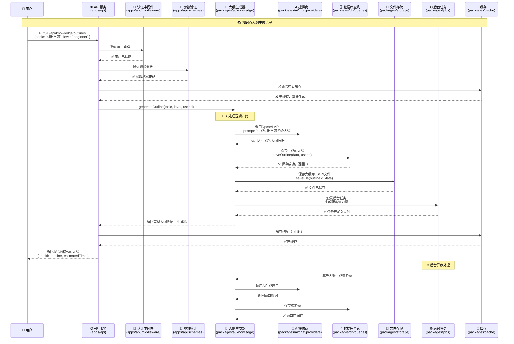
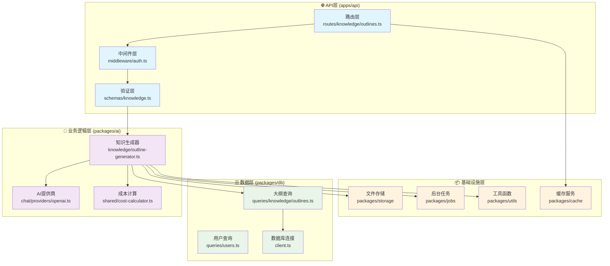

# AI Tools Monorepo 架构设计文档

## 📋 概述

本文档通过具体案例说明AI Tools项目的Monorepo架构设计，展示各模块之间的组织关系和协作方式。

## 🎯 案例：知识点大纲生成功能

我们以"用户请求生成机器学习知识点大纲"为例，展示完整的数据流和模块协作过程。

## 🔄 完整流程序列图



## 🏗️ 模块组织架构图



## 📁 完整文件系统结构

```
ai-tools/
├── apps/
│   ├── api/                          # API服务器
│   │   ├── src/
│   │   │   ├── routes/
│   │   │   │   ├── knowledge/        # 知识点大纲与题目生成路由
│   │   │   │   │   ├── outlines.ts   # 大纲生成API
│   │   │   │   │   ├── quizzes.ts    # 题目生成API
│   │   │   │   │   └── index.ts      # 路由汇总
│   │   │   │   ├── chat/             # 多模型问答路由
│   │   │   │   │   ├── models.ts     # 模型列表API
│   │   │   │   │   ├── conversations.ts # 对话管理API
│   │   │   │   │   ├── multi-chat.ts # 多模型对话API
│   │   │   │   │   └── index.ts      # 路由汇总
│   │   │   │   ├── voice/            # 语音功能路由
│   │   │   │   │   ├── stt.ts        # 语音转文本API
│   │   │   │   │   ├── tts.ts        # 文本转语音API
│   │   │   │   │   └── index.ts      # 路由汇总
│   │   │   │   └── index.ts          # 总路由入口
│   │   │   ├── middleware/
│   │   │   │   ├── auth.ts           # 认证中间件
│   │   │   │   ├── validation.ts     # 参数验证中间件
│   │   │   │   └── rate-limit.ts     # 限流中间件
│   │   │   ├── schemas/              # API请求/响应验证
│   │   │   │   ├── knowledge.ts      # 知识生成相关schema
│   │   │   │   ├── chat.ts           # 聊天相关schema
│   │   │   │   └── voice.ts          # 语音相关schema
│   │   │   └── index.ts
│   │   └── package.json
│   └── dashboard/                    # 前端界面（后续）
├── packages/
│   ├── db/                          # 数据库层
│   │   ├── src/
│   │   │   ├── schema.ts            # 数据库表结构
│   │   │   ├── client.ts            # 数据库连接
│   │   │   ├── queries/             # 按功能分类的查询
│   │   │   │   ├── knowledge/       # 知识相关查询
│   │   │   │   │   ├── outlines.ts  # 大纲存储查询
│   │   │   │   │   └── quizzes.ts   # 题目存储查询
│   │   │   │   ├── conversations/   # 对话相关查询
│   │   │   │   │   ├── messages.ts  # 消息查询
│   │   │   │   │   └── multi-responses.ts # 多模型响应查询
│   │   │   │   ├── voice/           # 语音相关查询
│   │   │   │   │   ├── audio-files.ts # 音频文件查询
│   │   │   │   │   └── transcriptions.ts # 转录记录查询
│   │   │   │   └── users.ts         # 用户相关查询
│   │   │   └── migrations/          # 数据库迁移文件
│   │   └── package.json
│   ├── ai/                          # AI核心功能包
│   │   ├── src/
│   │   │   ├── knowledge/           # 知识生成模块
│   │   │   │   ├── outline-generator.ts  # 大纲生成器
│   │   │   │   ├── quiz-generator.ts     # 题目生成器
│   │   │   │   ├── templates.ts          # 提示词模板
│   │   │   │   └── types.ts              # 类型定义
│   │   │   ├── chat/                # 多模型聊天模块
│   │   │   │   ├── multi-model.ts   # 多模型调用orchestrator
│   │   │   │   ├── providers/       # AI提供商适配器
│   │   │   │   │   ├── openai.ts    # OpenAI适配器
│   │   │   │   │   ├── claude.ts    # Claude适配器
│   │   │   │   │   ├── gemini.ts    # Gemini适配器
│   │   │   │   │   └── index.ts     # 提供商统一导出
│   │   │   │   ├── streaming.ts     # 流式响应处理
│   │   │   │   └── types.ts         # 类型定义
│   │   │   ├── voice/               # 语音处理模块
│   │   │   │   ├── stt/             # 语音转文本
│   │   │   │   │   ├── whisper.ts   # Whisper集成
│   │   │   │   │   ├── processor.ts # 音频预处理
│   │   │   │   │   └── types.ts     # STT类型定义
│   │   │   │   ├── tts/             # 文本转语音
│   │   │   │   │   ├── elevenlabs.ts # ElevenLabs集成
│   │   │   │   │   ├── azure.ts     # Azure Speech集成
│   │   │   │   │   ├── synthesizer.ts # 语音合成器
│   │   │   │   │   └── types.ts     # TTS类型定义
│   │   │   │   ├── formats/         # 音频格式处理
│   │   │   │   │   ├── converter.ts # 格式转换
│   │   │   │   │   └── validator.ts # 格式验证
│   │   │   │   └── types.ts         # 语音模块总类型
│   │   │   ├── shared/              # 共享功能
│   │   │   │   ├── streaming.ts     # 通用流式处理
│   │   │   │   ├── cost-calculator.ts # 成本计算
│   │   │   │   ├── rate-limiter.ts  # API限流
│   │   │   │   └── utils.ts         # 工具函数
│   │   │   └── index.ts             # 统一导出
│   │   └── package.json
│   ├── jobs/                        # 后台任务处理
│   │   ├── src/
│   │   │   ├── tasks/
│   │   │   │   ├── knowledge/       # 知识生成任务
│   │   │   │   │   ├── batch-outline.ts # 批量大纲生成
│   │   │   │   │   └── batch-quiz.ts    # 批量题目生成
│   │   │   │   ├── voice/           # 语音处理任务
│   │   │   │   │   ├── audio-processing.ts # 音频处理任务
│   │   │   │   │   └── batch-tts.ts     # 批量语音合成
│   │   │   │   └── cleanup/         # 清理任务
│   │   │   │       ├── temp-files.ts    # 临时文件清理
│   │   │   │       └── old-records.ts   # 旧记录清理
│   │   │   ├── queues/              # 任务队列管理
│   │   │   └── workers/             # 工作进程
│   │   └── package.json
│   ├── storage/                     # 文件存储抽象
│   │   ├── src/
│   │   │   ├── providers/
│   │   │   │   ├── local.ts         # 本地存储
│   │   │   │   ├── s3.ts            # AWS S3存储
│   │   │   │   └── supabase.ts      # Supabase存储
│   │   │   ├── audio/               # 音频文件管理
│   │   │   │   ├── uploader.ts      # 音频上传
│   │   │   │   ├── processor.ts     # 音频处理
│   │   │   │   └── cleanup.ts       # 音频清理
│   │   │   └── index.ts
│   │   └── package.json
│   ├── ui/                          # 共享UI组件（前端用）
│   │   ├── src/
│   │   │   ├── components/
│   │   │   │   ├── knowledge/       # 知识生成组件
│   │   │   │   ├── chat/            # 聊天界面组件
│   │   │   │   ├── voice/           # 语音界面组件
│   │   │   │   └── shared/          # 共享基础组件
│   │   │   └── hooks/               # React Hooks
│   │   └── package.json
│   ├── utils/                       # 共享工具函数
│   ├── cache/                       # 缓存抽象层
│   └── supabase/                    # 认证与实时功能
└── docs/                            # 项目文档
    ├── api/                         # API文档
    │   ├── knowledge.md             # 知识生成API文档
    │   ├── chat.md                  # 聊天API文档
    │   └── voice.md                 # 语音API文档
    ├── deployment/                  # 部署文档
    └── examples/                    # 使用示例
```

## 🎯 分模块的核心意义

### 1. 职责分离 (Separation of Concerns)

| 层次 | 职责 | 示例文件 |
|------|------|----------|
| 🌐 **API层** | HTTP请求处理、参数验证、响应格式化 | `apps/api/routes/knowledge/outlines.ts` |
| 🤖 **业务逻辑层** | 核心算法、AI调用、业务规则 | `packages/ai/knowledge/outline-generator.ts` |
| 🗄️ **数据层** | 数据存储、查询、持久化 | `packages/db/queries/knowledge/outlines.ts` |
| 📦 **基础设施层** | 通用服务（缓存、文件、队列等） | `packages/cache/`, `packages/storage/` |

### 2. 可复用性 (Reusability)

```
✅ packages/ai/knowledge/ → 大纲生成器可以被多个API端点复用
✅ packages/db/queries/   → 数据查询可以被API和后台任务复用  
✅ packages/cache/        → 缓存服务可以被所有模块复用
✅ packages/storage/      → 文件存储可以被语音、知识等功能复用
```

### 3. 独立部署和扩展

```
🚀 apps/api/              → 可以独立部署为API服务器
🚀 packages/jobs/         → 可以独立部署为后台任务处理器
🚀 packages/ai/knowledge/ → 可以作为微服务独立部署
🚀 packages/voice/        → 可以单独部署为语音处理服务
```

### 4. 开发协作

```
👥 团队A → 专门负责 packages/ai/ 的AI算法优化
👥 团队B → 专门负责 apps/api/ 的接口开发  
👥 团队C → 专门负责 packages/db/ 的数据库设计
👥 团队D → 专门负责 packages/ui/ 的前端组件
```

### 5. 测试隔离

```
🧪 packages/ai/knowledge/ → 可以独立进行单元测试
🧪 packages/db/queries/   → 可以用测试数据库进行集成测试
🧪 apps/api/routes/       → 可以mock依赖进行接口测试
🧪 packages/voice/        → 可以用测试音频进行功能测试
```

## 💡 实际开发工作流程

当你开发"知识点大纲生成"功能时的步骤：

### 第一步：数据结构设计
```bash
📝 编辑 packages/db/schema.ts
   └── 定义 outlines 表结构
```

### 第二步：数据查询实现
```bash
📝 编辑 packages/db/queries/knowledge/outlines.ts
   ├── createOutline() - 创建大纲
   ├── getOutlineById() - 获取大纲
   └── getUserOutlines() - 获取用户的所有大纲
```

### 第三步：核心算法开发
```bash
📝 编辑 packages/ai/knowledge/outline-generator.ts
   ├── generateOutline() - 核心生成逻辑
   ├── formatOutlineData() - 数据格式化
   └── validateOutline() - 结果验证
```

### 第四步：API端点创建
```bash
📝 编辑 apps/api/routes/knowledge/outlines.ts
   ├── POST /outlines - 创建大纲
   ├── GET /outlines/:id - 获取大纲
   └── GET /outlines - 获取用户大纲列表
```

### 第五步：后台任务添加
```bash
📝 编辑 packages/jobs/tasks/knowledge/batch-outline.ts
   └── 批量处理大纲生成任务
```

## 🚀 模块间通信示例

### 典型的导入关系：

```typescript
// apps/api/routes/knowledge/outlines.ts
import { generateOutline } from '@ai-tools/ai/knowledge';
import { createOutline, getOutlineById } from '@ai-tools/db/queries';
import { cache } from '@ai-tools/cache';

// packages/ai/knowledge/outline-generator.ts  
import { callOpenAI } from '@ai-tools/ai/chat/providers';
import { calculateCost } from '@ai-tools/ai/shared';
import { uploadFile } from '@ai-tools/storage';

// packages/jobs/tasks/knowledge/batch-outline.ts
import { generateOutline } from '@ai-tools/ai/knowledge';
import { getUserOutlines } from '@ai-tools/db/queries';
```

## 📈 架构优势总结

| 优势 | 说明 | 实际效果 |
|------|------|----------|
| 🔧 **专注开发** | 每次只需要关注一个模块 | 降低认知负担，提高开发效率 |
| 🚀 **快速迭代** | 修改一个功能不影响其他模块 | 减少回归测试，加快发布速度 |
| 🔄 **代码复用** | 一次编写，多处使用 | 减少重复代码，提高维护性 |
| 👥 **团队协作** | 不同人员可以并行开发不同模块 | 提高团队效率，减少冲突 |
| 🧪 **测试友好** | 各模块可以独立测试 | 提高测试覆盖率，便于调试 |
| 📦 **独立部署** | 模块可以根据需要独立部署 | 提高系统可扩展性和容错性 |

## 🎭 总结

这种Monorepo架构让你可以：

- **从小做起** → 先实现一个功能的基础版本
- **逐步扩展** → 在稳定的基础上添加新功能
- **团队协作** → 多人可以同时开发不同模块
- **独立测试** → 每个模块都可以单独验证
- **灵活部署** → 根据需要选择部署策略

记住：**架构的核心不是复杂，而是清晰！**每个文件都有明确的职责，每个模块都有清晰的边界，这样才能让项目长期健康发展。